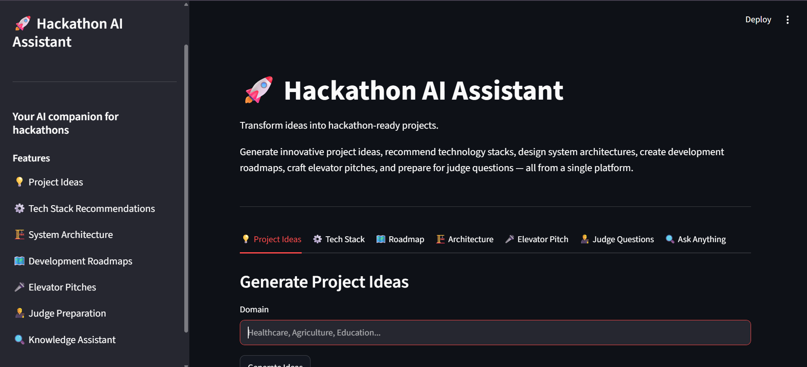
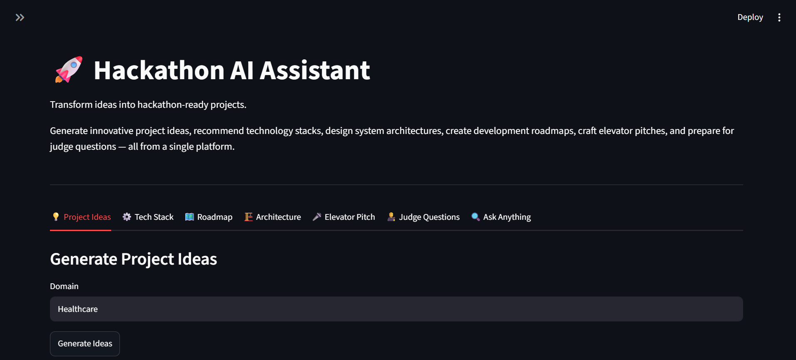
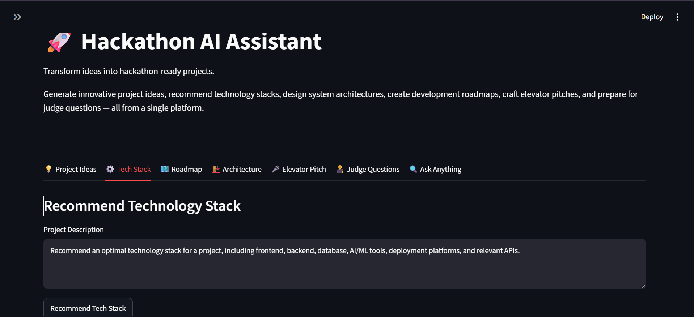
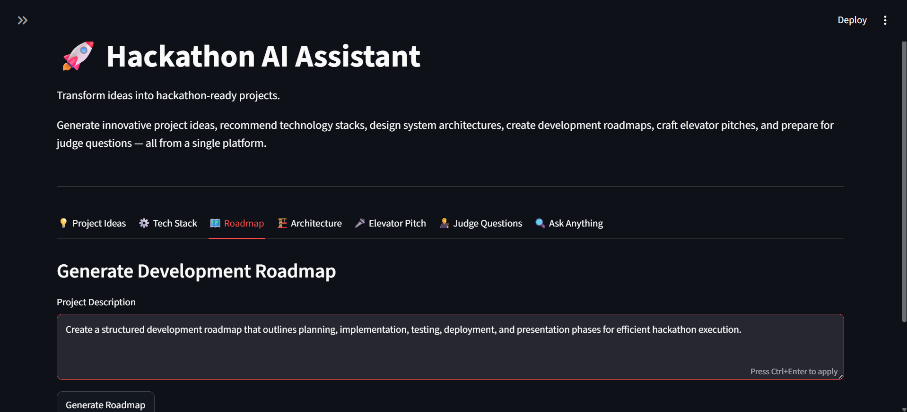
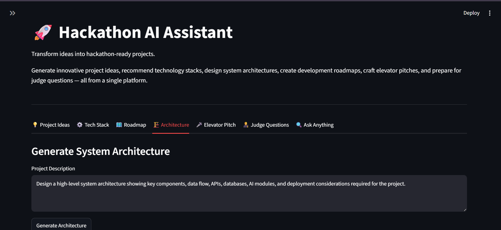
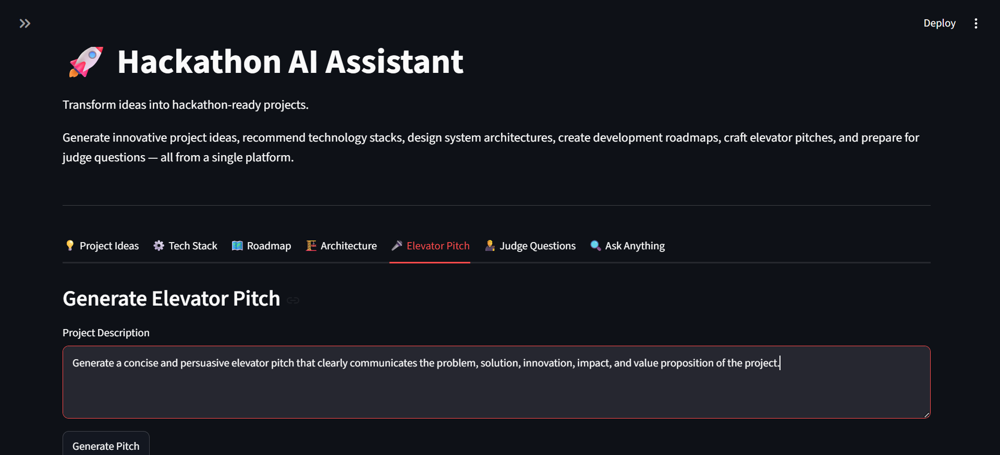
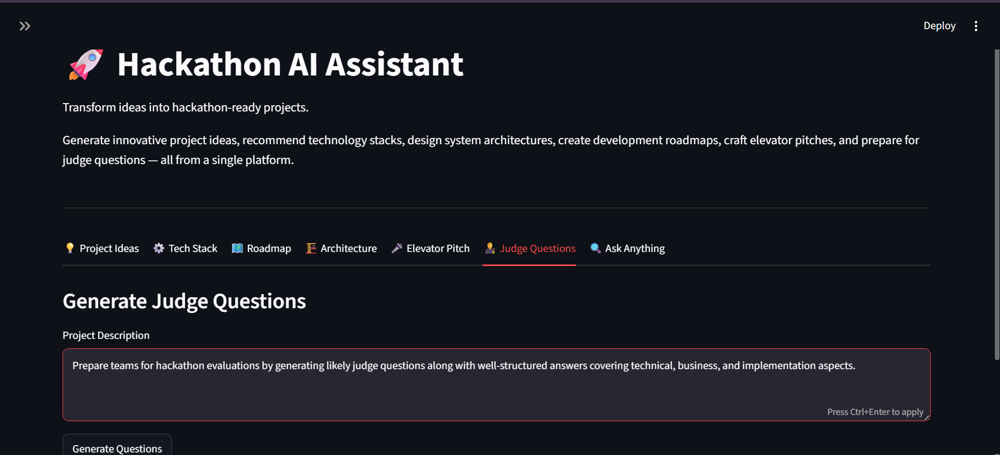
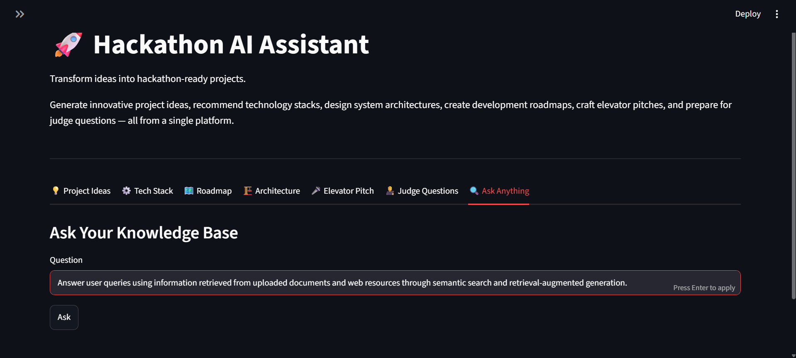

# 🚀 Hackathon AI Assistant

An AI-powered platform that helps hackathon teams transform ideas into complete project plans using Retrieval-Augmented Generation (RAG), semantic search, and large language models.

The system assists users with project ideation, technology selection, architecture design, roadmap creation, elevator pitches, judge preparation, and knowledge-based question answering.

---

## Features

### 💡 Project Ideas
Generate innovative hackathon project ideas with problem statements, solutions, innovations, and expected impact.

### ⚙️ Tech Stack Recommendation
Suggest suitable technologies including frontend, backend, databases, AI tools, deployment platforms, and APIs.

### 🗺️ Development Roadmap
Create a step-by-step execution plan covering planning, development, testing, deployment, and presentation.

### 🏗️ System Architecture
Design high-level architectures illustrating components, data flow, databases, APIs, and AI modules.

### 🎤 Elevator Pitch Generator
Craft concise and compelling pitches for project presentations and demonstrations.

### 🧑‍⚖️ Judge Preparation
Generate potential judge questions with structured answers.

### 🔍 Knowledge Assistant
Perform semantic search over documents and web resources to provide context-aware answers.

---

## Tech Stack

- Python
- LangChain
- Hugging Face Embeddings
- Qdrant Vector Database
- Google Gemini
- Streamlit

---

## Project Workflow

PDFs / URLs

↓

Chunking

↓

Embeddings

↓

Qdrant

↓

Retriever

↓

Gemini

↓

User Interface

---

## Project Structure

```text
Hackathon-AI-Assistant/
│
├── app.py
├── requirements.txt
├── README.md
├── .gitignore
├── docker-compose.db.yml
│
├── src/
│   ├── config.py
│   ├── rag.py
│   └── features.py
│
├── data/
│   ├── problem_statements/
│   ├── winning_projects/
│   └── urls/
│
├── screenshots/
│   ├── home_page.png
│   ├── project_ideas.png
│   ├── tech_stack.png
│   ├── roadmap.png
│   ├── architecture.png
│   ├── elevator_pitch.png
│   ├── judge_questions.png
│   └── ask_anything.png
│
└── notebooks/
    └── document_loading.ipynb
```

## Screenshots

### Home Page



### Project Ideas



### Technology Stack Recommendation



### Development Roadmap



### System Architecture



### Elevator Pitch



### Judge Questions



### Knowledge Assistant



---

## Installation

Clone repository

```bash
git clone <repository-url>
```

Install dependencies

```bash
pip install -r requirements.txt
```

Run Qdrant

```bash
docker compose -f docker-compose.db.yml up
```

Run application

```bash
streamlit run app.py
```

---

## Future Improvements

- Upload PDFs from UI
- Add URLs from UI
- Architecture diagrams
- Export generated results

---

## Author

**Nerusu Sai Niharika**
