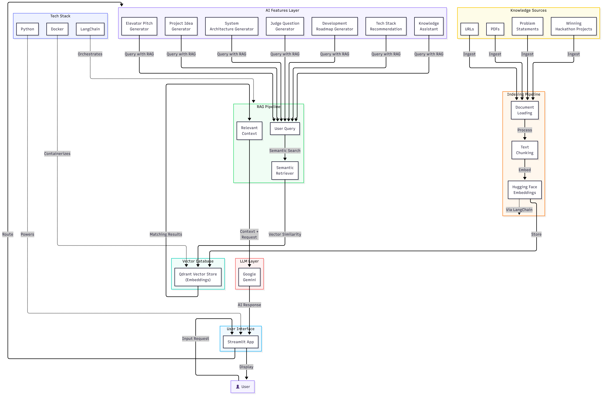
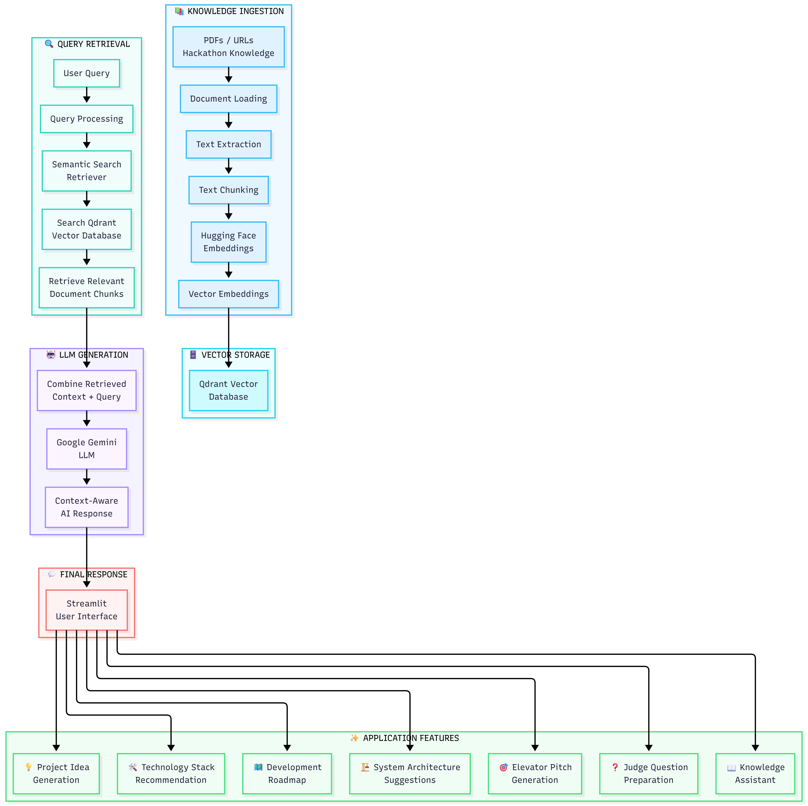
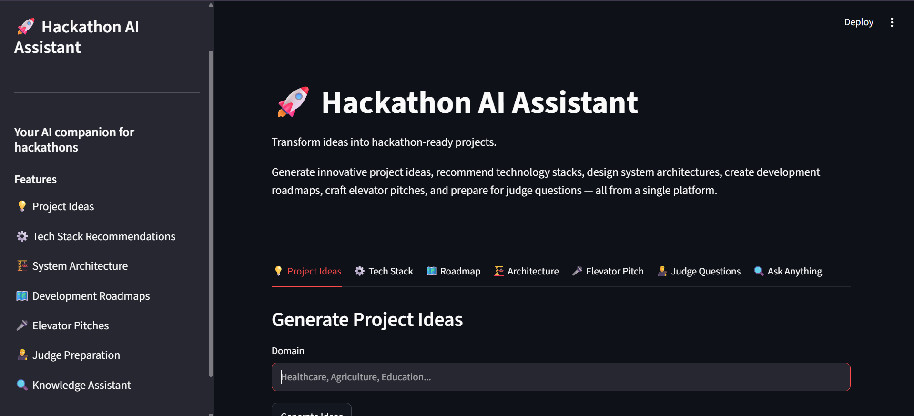
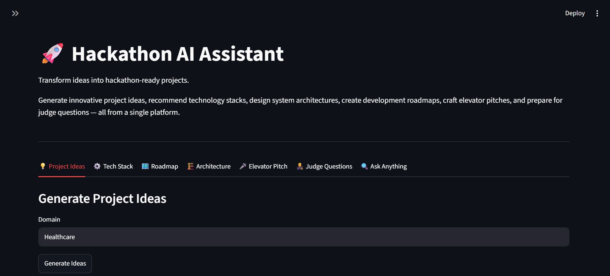
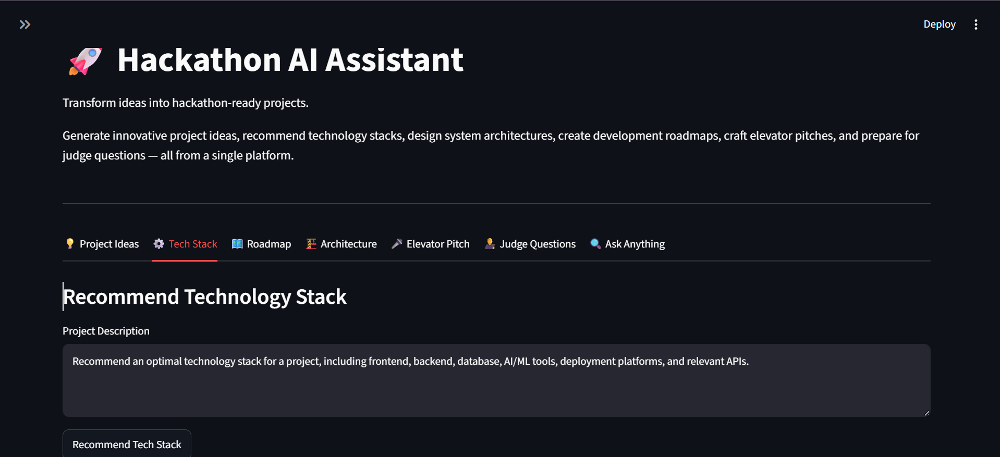
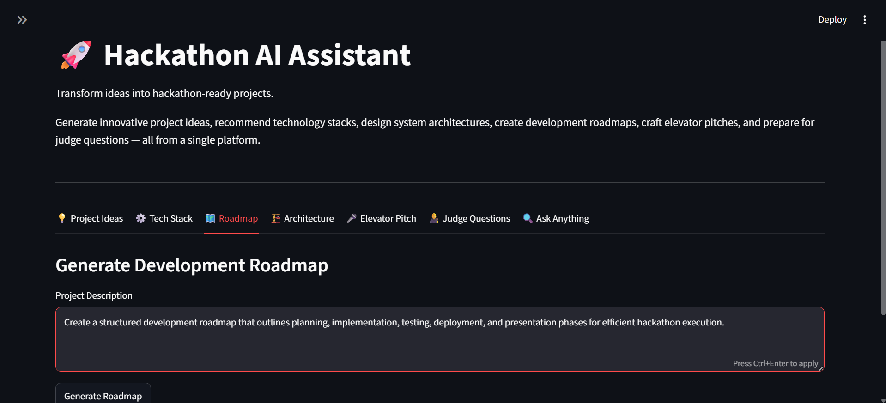
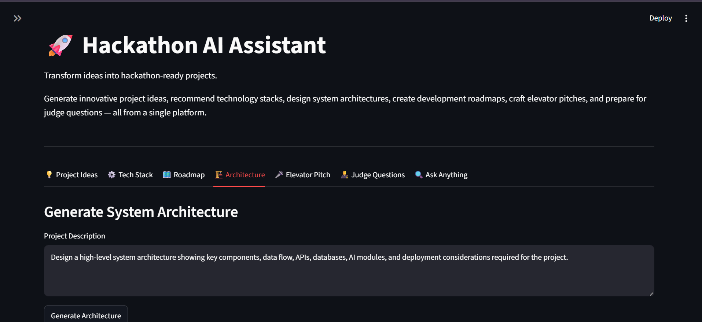
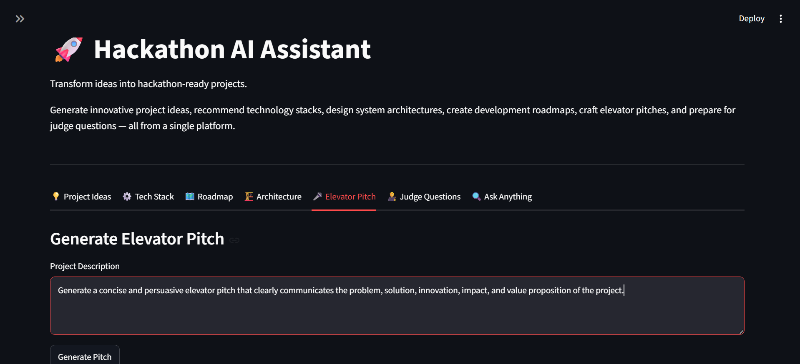
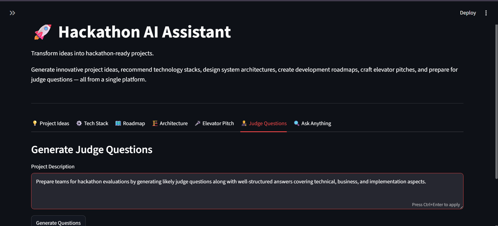
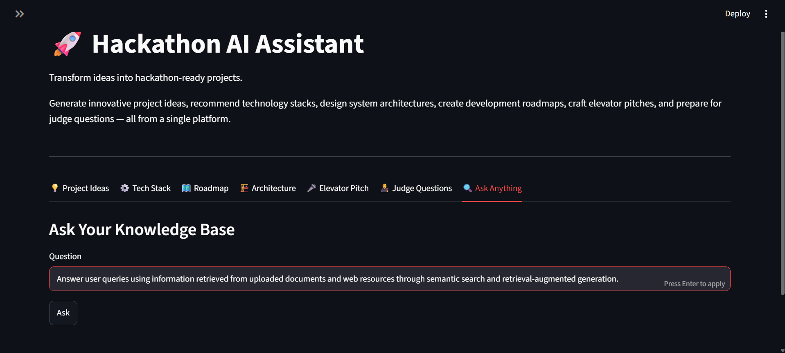

<div align="center">

# 🚀 Hackathon AI Assistant

### *An AI-powered hackathon planning assistant that transforms project ideas into structured plans using Retrieval-Augmented Generation, semantic search, and Large Language Models.*

<p>


</p>

</div>

---

# 📖 Overview

**Hackathon AI Assistant** is an AI-powered platform designed to help hackathon teams transform initial project ideas into complete and structured project plans.

The application combines **Retrieval-Augmented Generation (RAG)**, semantic vector search, document knowledge retrieval, and Large Language Models to provide context-aware assistance throughout the hackathon development process.

The platform helps teams with **project ideation, technology selection, architecture planning, development roadmaps, elevator pitches, judge preparation, and knowledge-based question answering**.

By combining a curated knowledge base of problem statements and winning projects with semantic retrieval and Gemini-powered generation, the system provides more context-aware and relevant recommendations.

---

# ✨ Features

### 💡 Project Idea Generator

Generate innovative hackathon project ideas with:

* Problem statements
* Proposed solutions
* Innovation aspects
* Expected impact
* Project concepts based on retrieved knowledge

### ⚙️ Technology Stack Recommendation

Suggest suitable technologies for a proposed project, including:

* Frontend technologies
* Backend technologies
* Databases
* AI/ML tools
* APIs
* Deployment platforms

### 🗺️ Development Roadmap

Generate structured execution plans covering:

* Project planning
* Development
* Testing
* Deployment
* Final presentation

### 🏗️ System Architecture

Generate high-level architecture recommendations showing:

* Application components
* Data flow
* APIs
* Databases
* AI modules
* System interactions

### 🎤 Elevator Pitch Generator

Create concise and compelling project pitches designed for:

* Hackathon presentations
* Project demonstrations
* Judge introductions
* Quick project explanations

### 🧑‍⚖️ Judge Preparation

Prepare teams for hackathon evaluations by generating:

* Potential judge questions
* Structured answers
* Technical questions
* Project-specific discussion points

### 🔍 Knowledge Assistant

Use semantic search and retrieved knowledge to provide context-aware answers from:

* Uploaded documents
* Problem statements
* Winning project references
* Web resources

---

# 🏗️ System Architecture

<p align="center">
  
</p>

The application follows a RAG-based architecture where knowledge sources are processed, converted into vector embeddings, and stored in Qdrant.

When a user requests information, the system retrieves semantically relevant context from the vector database and provides that context to Google Gemini for generating the final response.

The Streamlit interface acts as the interaction layer through which users access the different hackathon assistance features.

---

# 🔄 RAG Workflow

<p align="center">
  
</p>

The knowledge retrieval pipeline follows these steps:

1. 📄 Load documents and URLs.
2. ✂️ Split content into smaller chunks.
3. 🧠 Generate embeddings using Hugging Face Embeddings.
4. 🗄️ Store embeddings in Qdrant.
5. 🔍 Retrieve semantically relevant documents based on the user's query.
6. 📚 Combine retrieved context with the user's request.
7. 🤖 Send the contextual prompt to Google Gemini.
8. 💡 Generate a context-aware response.
9. 🖥️ Display the result through the Streamlit interface.

---

# 🧩 AI-Assisted Hackathon Workflow

The platform supports multiple stages of hackathon project development:

```text
Project Idea
     ↓
Problem Understanding
     ↓
Project Idea Generation
     ↓
Technology Stack Recommendation
     ↓
System Architecture
     ↓
Development Roadmap
     ↓
Elevator Pitch
     ↓
Judge Question Preparation
     ↓
Knowledge-Based Assistance
```

This allows teams to move from an initial idea to a structured and presentation-ready project plan.

---

# 🛠️ Tech Stack

| Category                 | Technologies                                     |
| ------------------------ | ------------------------------------------------ |
| **Programming Language** | Python                                           |
| **AI Framework**         | LangChain                                        |
| **LLM**                  | Google Gemini                                    |
| **Embeddings**           | Hugging Face Embeddings                          |
| **Vector Database**      | Qdrant                                           |
| **RAG**                  | Retrieval-Augmented Generation                   |
| **Frontend / UI**        | Streamlit                                        |
| **Containerization**     | Docker                                           |
| **Knowledge Sources**    | PDFs, URLs, Problem Statements, Winning Projects |

---

# 📸 Application Preview

## 🏠 Home Page

<p align="center">
  
</p>

---

## 💡 Project Ideas

<p align="center">
  
</p>

Generate innovative hackathon project ideas based on the available knowledge base and user requirements.

---

## ⚙️ Technology Stack Recommendation

<p align="center">
  
</p>

Receive technology recommendations for building and deploying the proposed project.

---

## 🗺️ Development Roadmap

<p align="center">
  
</p>

Generate a structured roadmap that guides the team from planning through deployment and presentation.

---

## 🏗️ System Architecture

<p align="center">
  
</p>

Generate a high-level architecture for the proposed hackathon project.

---

## 🎤 Elevator Pitch

<p align="center">
  
</p>

Generate concise project pitches suitable for hackathon presentations and demonstrations.

---

## 🧑‍⚖️ Judge Questions

<p align="center">
  
</p>

Prepare for project evaluation by generating potential questions and structured answers.

---

## 🔍 Knowledge Assistant

<p align="center">
  
</p>

Ask questions and receive context-aware answers using semantic retrieval from the project's knowledge base.

---

# 📂 Project Structure

```text
Hackathon-AI-Assistant/
│
├── app.py
├── requirements.txt
├── README.md
├── .gitignore
├── docker-compose.db.yml
│
├── src/
│   ├── config.py
│   ├── rag.py
│   └── features.py
│
├── data/
│   ├── problem_statements/
│   ├── winning_projects/
│   └── urls/
│
├── screenshots/
│   ├── system_architecture.png
│   ├── rag_workflow.png
│   ├── home_page.png
│   ├── project_ideas.png
│   ├── tech_stack.png
│   ├── roadmap.png
│   ├── architecture.png
│   ├── elevator_pitch.png
│   ├── judge_questions.png
│   └── ask_anything.png
│
└── notebooks/
    └── document_loading.ipynb
```

---

# ⚙️ Installation

### 1. Clone the Repository

```bash
git clone <repository-url>
cd Hackathon-AI-Assistant
```

### 2. Install Dependencies

```bash
pip install -r requirements.txt
```

### 3. Configure the Application

Configure the required API keys and application settings according to the configuration defined in `src/config.py`.

### 4. Start Qdrant

```bash
docker compose -f docker-compose.db.yml up
```

### 5. Run the Application

```bash
streamlit run app.py
```

The application will open in your browser through the Streamlit interface.

---

# 🧠 How RAG Is Used

The application uses Retrieval-Augmented Generation to provide the language model with relevant information from the project's knowledge sources.

The process can be summarized as:

```text
Knowledge Sources
       ↓
Document Processing
       ↓
Text Chunking
       ↓
Embedding Generation
       ↓
Qdrant Vector Storage
       ↓
Semantic Retrieval
       ↓
Relevant Context
       ↓
Google Gemini
       ↓
Generated Response
```

This allows the assistant to generate responses based on retrieved project-specific knowledge rather than relying only on the LLM's general knowledge.

---

# 🚀 Future Enhancements

* 📄 Upload PDFs directly from the UI
* 🔗 Add URLs directly from the UI
* 🏗️ Automated architecture diagram generation
* 📥 Export generated results
* 📊 Project evaluation scoring
* 🏆 Hackathon project ranking
* 👥 Collaborative team workspace
* 📑 Complete project documentation generation
* 🎤 Presentation and pitch deck generation

---

# 🎓 Learning Outcomes

Through this project, I gained practical experience in:

* Retrieval-Augmented Generation
* Semantic Search
* Vector Databases
* Document Processing
* Embedding Generation
* LangChain
* Large Language Model Integration
* Prompt Engineering
* Streamlit Application Development
* Docker and Qdrant
* Building AI-powered productivity and planning tools
* Developing end-to-end AI applications

---

# 👩‍💻 Author

**N Sai Niharika**

Developed as an AI-powered hackathon assistant combining RAG, semantic search, vector databases, and Large Language Models to support teams throughout the hackathon development process.

---

# 📄 License

This project is intended for educational, research, and learning purposes.
